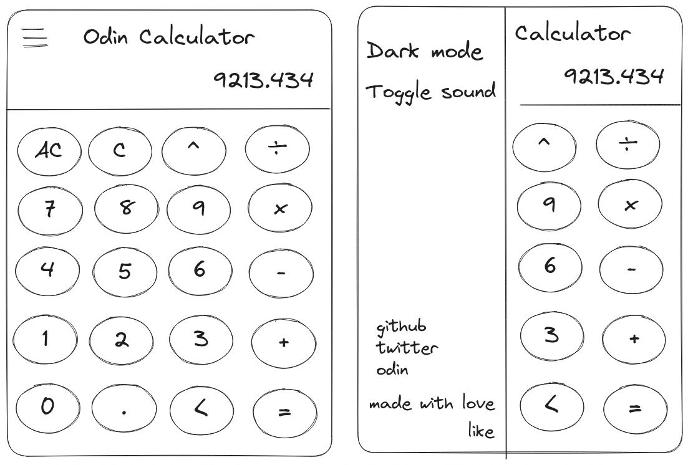

# Calculator

An online calculator with basic arithmetic operations built using HTML5, CSS3 and JS. It can be controlled by a mouse or by a keyboard.

## Demo

You can try it online [here](https://i4pg.github.io/calculator).

## Features

*   All basic operations are supported Multiplication, Division, Subtraction, Addition & Modulo Division
*   Support negative values
*   Full Keyboard support including visual effects
*   Options to clear/delete a single input -backspace- OR clear the whole display -reset operand- OR reset everyting.
*   Option for toggling sound Effect
*   Clean UI
*   Responsive Mobile-First
*   Dark/Light mode

## Showcase

### Wireframe

### ScreenShots

<!--  -->

<!--  -->

<!--  -->

<!--  -->

## Getting Started

### Usage

You can try it online [here](https://i4pg.github.io/calculator).

### Installation

To run this program locally, you can clone the repository to your local machine using the following command:

`git clone https://github.com/i4pg/calculator.git`

Then open the `index.html` file in your web browser to start playing the game.

### To-do

- [x] OOP 
> NOTE: for now I'll go with old school -Object Constructor-
- [x] Calculator Logic
    - [x] Add
    - [x] Subtract
    - [x] Multiply
    - [x] Divide
    - [x] Modulo
- [x] Calculator UX
    - [x] Negative numbers support 
    - [x] Display Numbers
    - [x] Support float numbers
    - [x] Support Infinite operations
    - [x] Support Keyboard input
    - [x] Round with long decimals -Prevent Overflow-
    - [x] Zero divider Error
    - [x] Clear Button
    - [x] Backspace Button
    - [x] Sounds Effects
    - [x] Pressing Enter same as `=` 
    - [x] buttons hover effect on click event
    - [x] Sounds On/Off
    - [x] aside navigation
- [x] UI
    - [x] Smooth colors
    - [x] Calculator display
    - [x] calculator buttons
    - [x] Mobile-first Responsive
    - [x] Dark/Light mode
    - [x] button hover animation
    - [x] Footer

## Contributing

Contributions to this project are welcome. To contribute, follow these steps:

1.  Fork this repository.
    
2.  Create a new branch with your changes:
    
    `git checkout -b my-new-branch`
3.  Make your changes and commit them:
    
    `git commit -am 'Add some feature'`
4.  Push your changes to your forked repository:
    
    `git push origin my-new-branch`
5.  Create a pull request on this repository.
    
## Acknowledgement

Project inspiration from [The Odin Project](https://www.theodinproject.com).

## License

This project is licensed under the MIT License. See the [LICENSE](LICENSE) file for details.
